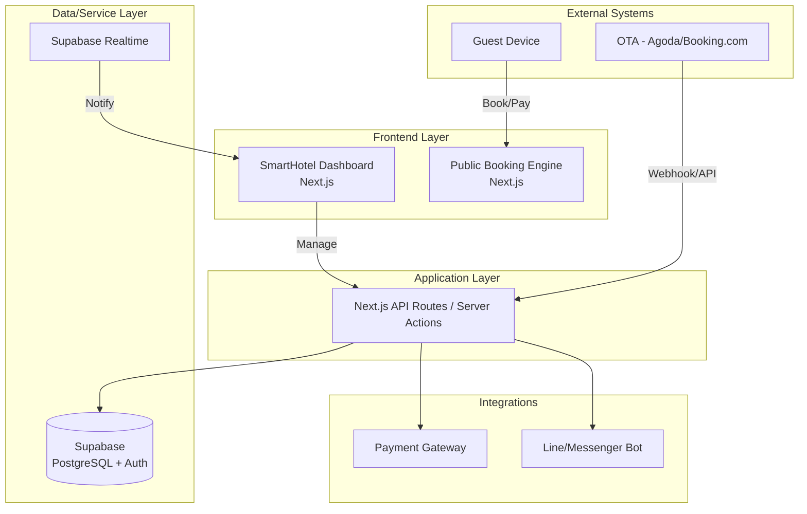

# Design Document: SmartHotel PMS

## Overview

This design defines the architecture for the "SmartHotel PMS," a modern, automated property management system tailored for small-to-medium boutique hotels (10-20 rooms). The system transitions property management from manual, spreadsheet-based tracking to an automated, real-time platform.

### Goals

1.  Automate the booking lifecycle from discovery to check-out.
2.  Provide a real-time, 1-glance dashboard for room availability and occupancy.
3.  Implement automated payment processing to eliminate outstanding balances.
4.  Streamline housekeeping operations with real-time status updates.
5.  Establish a scalable architecture using modern web technologies.
6.  Ensure data consistency across multiple booking channels (Channel Manager integration).
7.  Implement a guest CRM to track preferences and booking history.

## Architecture

### High-Level Architecture



### Architecture Principles

1.  **Real-time First**: Using Supabase Realtime to ensure the dashboard reflects the latest booking status instantly.
2.  **Scalable Data Model**: Relational PostgreSQL schema allowing for complex queries (availability checks, revenue analytics).
3.  **API-First Approach**: All operations are managed via secure API endpoints/server actions.
4.  **Security by Default**: Row Level Security (RLS) in Supabase ensures property owners only access their data.

## Components and Interfaces

### 1. Database Schema (Supabase/PostgreSQL)

**Tables**:
*   `rooms`: id, room_number, type, base_price, status
*   `bookings`: id, guest_id, room_id, check_in, check_out, total_price, payment_status, booking_source
*   `guests`: id, name, email, phone, preferences
*   `payments`: id, booking_id, amount, status, gateway_reference
*   `housekeeping_logs`: id, room_id, status (clean/dirty), last_updated_by

### 2. Frontend Layer (Next.js)

**Structure**:
```
/src
├── components/
│ ├── Dashboard/
│ │ ├── RoomGrid.tsx
│ │ ├── BookingCard.tsx
│ │ └── HousekeepingStatus.tsx
│ ├── BookingEngine/
│ │ └── AvailabilityCalendar.tsx
├── lib/
│ ├── supabase-client.ts
│ └── stripe.ts
├── app/
│ ├── dashboard/
│ └── booking/
```

### 3. Integration Services

*   **Payment Processor**: Stripe integration for automated deposits and full payments.
*   **Notification Engine**: Messaging service (Line/Facebook) to send automated confirmation and reminders.
